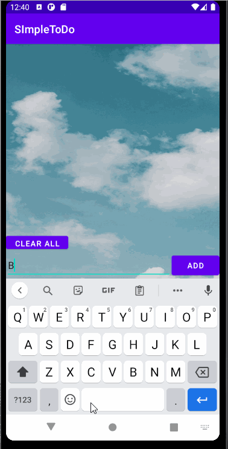

# Project 1 - *Simple ToDo*

**Name of your app** is an android app that allows building a todo list and basic todo items management functionality including adding new items, editing and deleting an existing item.

Submitted by: **Tommy Phong**

Time spent: **11+** hours spent in total

## User Stories

The following **required** functionality is completed:

* [x] User can **view a list of todo items**
* [x] User can **successfully add and remove items** from the todo list
* [x] User's **list of items persisted** upon modification and and retrieved properly on app restart

The following **optional** features are implemented:

* [x] User can **tap a todo item in the list and bring up an edit screen for the todo item** and then have any changes to the text reflected in the todo list

The following **additional** features are implemented:

* [x] List anything else that you can get done to improve the app functionality!

## Video Walkthrough

Here's a walkthrough of implemented user stories:

GIF created with [LiceCap](http://www.cockos.com/licecap/).

## Notes

Describe any challenges encountered while building the app.
A significant challenge I face while building this app was try to add a strik-through-text feature to my app when I remove an item from my list. I thought it was
a simple one liner and a little modification to my onLongClicked function but it turns out that wasn't the case. When I add a strike-through text I was painting 
over that data field. Thus, making it not so easy to remove. After hours of debugging I realized I could just combine strike-through-text with the remove feature.
After more tessting I discovered that my strike-through-text remain after deleting the item. After another countless hours debugging I called it quit and left it a lone.
The only bug I couldn't solve was getting rid of the strike-through-text after I close my app. 
## License

    Copyright [yyyy] [name of copyright owner]

    Licensed under the Apache License, Version 2.0 (the "License");
    you may not use this file except in compliance with the License.
    You may obtain a copy of the License at

        http://www.apache.org/licenses/LICENSE-2.0

    Unless required by applicable law or agreed to in writing, software
    distributed under the License is distributed on an "AS IS" BASIS,
    WITHOUT WARRANTIES OR CONDITIONS OF ANY KIND, either express or implied.
    See the License for the specific language governing permissions and
    limitations under the License.
